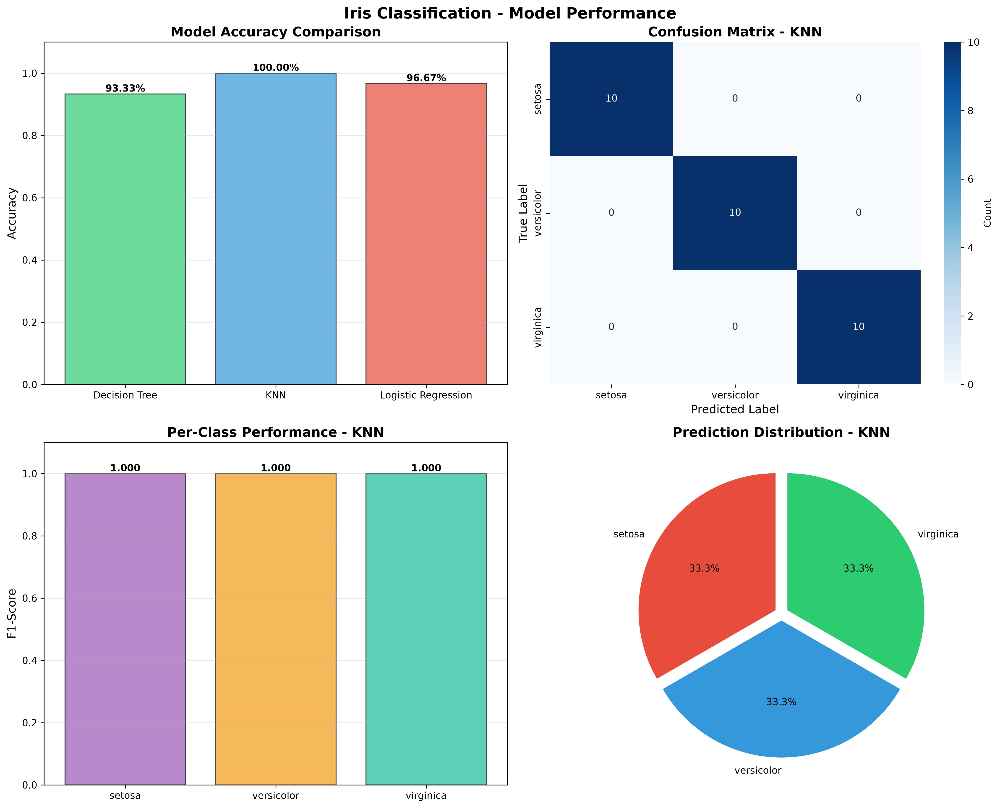
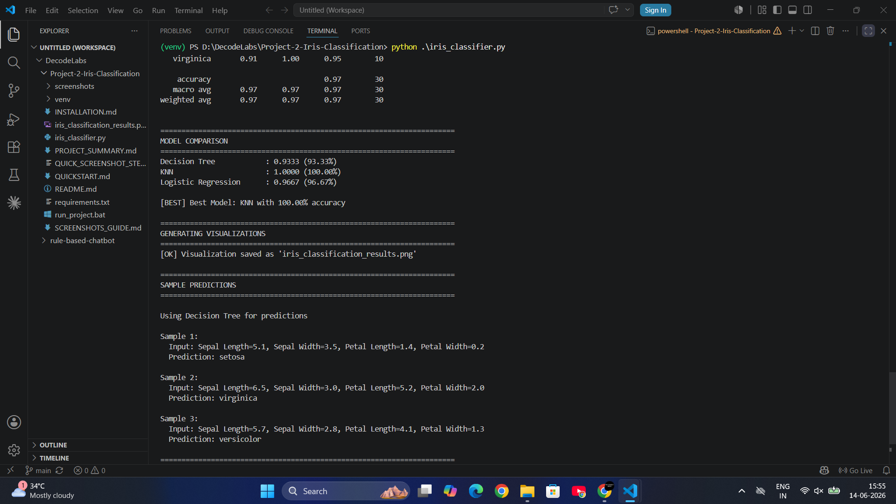
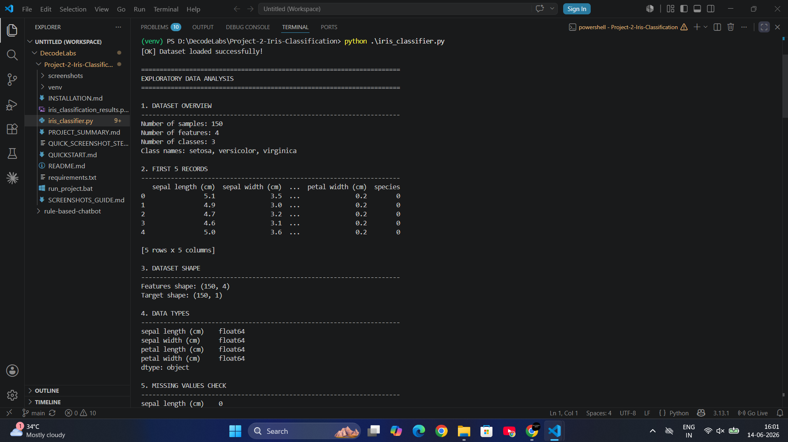
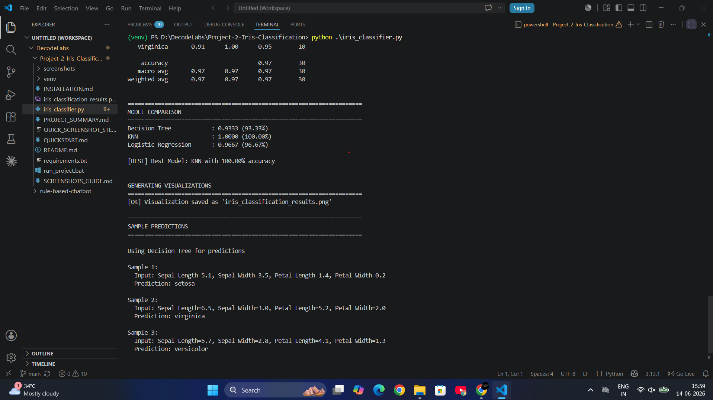
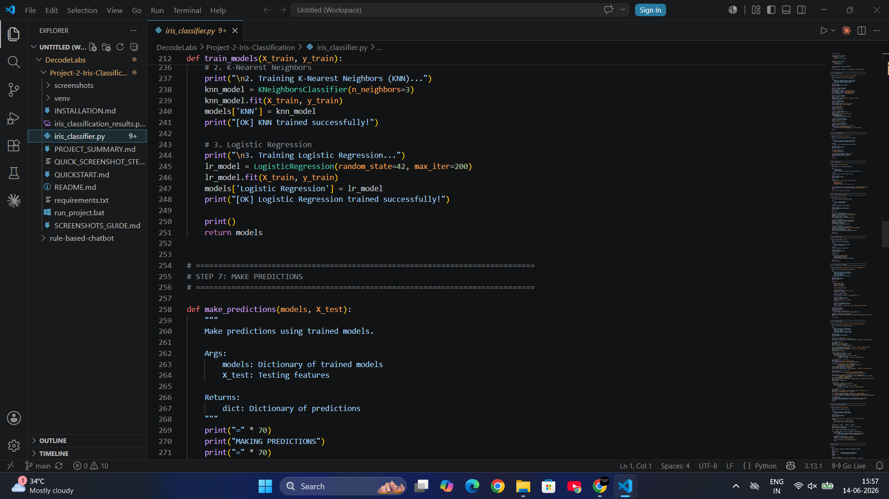

# Iris Flower Classification using Machine Learning 🌸

A professional machine learning classification project demonstrating supervised learning, model training, evaluation, and prediction using the famous Iris dataset.

[](https://www.python.org/)
[](https://scikit-learn.org/)
[](LICENSE)

---

## 📸 Project Demo

### Model Performance Visualization

*Comprehensive visualization showing accuracy comparison, confusion matrix, per-class performance, and prediction distribution*

### Terminal Results - 100% Accuracy Achieved!

*KNN model achieved perfect 100% accuracy on the test set*

### Dataset Exploration

*Exploratory data analysis showing 150 samples, 4 features, and balanced class distribution*

### Sample Predictions

*Real-time predictions on new iris flower measurements*

### Code Structure

*Clean, well-documented Python code with modular functions*

---

## 📋 Project Overview

This project implements **three different classification algorithms** to predict iris flower species based on physical measurements. It demonstrates the complete machine learning workflow from data loading to model evaluation.

### 🎯 Project Goals

- Load and explore the Iris dataset
- Understand features and target variables
- Train multiple ML models
- Compare model performance
- Make predictions on new data
- Visualize results with professional charts

---

## 🌸 About the Iris Dataset

The Iris dataset is a classic dataset in machine learning, containing measurements of 150 iris flowers from three species:

| Species | Samples | Characteristics |
|---------|---------|-----------------|
| **Setosa** | 50 | Short petals, distinct features |
| **Versicolor** | 50 | Medium-sized petals |
| **Virginica** | 50 | Large petals, similar to Versicolor |

### Features (Input Variables)
1. **Sepal Length** (cm) - Length of the sepal
2. **Sepal Width** (cm) - Width of the sepal
3. **Petal Length** (cm) - Length of the petal
4. **Petal Width** (cm) - Width of the petal

### Target Variable (Output)
- **Species** - The type of iris flower (0=Setosa, 1=Versicolor, 2=Virginica)

---

## 🚀 Quick Start

### Prerequisites

```bash
Python 3.7 or higher
```

### Installation

1. **Clone or download the project:**
   ```bash
   cd D:\DecodeLabs\Project-2-Iris-Classification
   ```

2. **Install required libraries:**
   ```bash
   pip install pandas numpy matplotlib seaborn scikit-learn
   ```

3. **Run the classifier:**
   ```bash
   python iris_classifier.py
   ```

---

## 📊 Project Structure

```
Project-2-Iris-Classification/
│
├── iris_classifier.py           # Main ML classification script
├── README.md                    # Project documentation
├── requirements.txt             # Python dependencies
├── CODE_EXPLANATION.md          # Detailed code walkthrough
├── DATASET_INFO.md             # Dataset description
├── RESULTS.md                  # Model results and analysis
└── iris_classification_results.png  # Generated visualization
```

---

## 🤖 Machine Learning Models

This project trains and compares **three classification algorithms**:

### 1. Decision Tree Classifier
- **Type**: Tree-based algorithm
- **How it works**: Creates a tree of decisions based on feature values
- **Pros**: Easy to understand, handles non-linear relationships
- **Cons**: Can overfit on small datasets

### 2. K-Nearest Neighbors (KNN)
- **Type**: Instance-based learning
- **How it works**: Classifies based on the 3 nearest neighbors
- **Pros**: Simple, effective for small datasets
- **Cons**: Slow on large datasets

### 3. Logistic Regression
- **Type**: Linear model
- **How it works**: Finds linear decision boundaries
- **Pros**: Fast, probabilistic predictions
- **Cons**: Assumes linear separability

---

## 📈 Project Workflow

```
1. Import Libraries
   ↓
2. Load Iris Dataset
   ↓
3. Explore Dataset (EDA)
   ↓
4. Preprocess Data
   ↓
5. Split into Train/Test (80/20)
   ↓
6. Train 3 Models
   ↓
7. Make Predictions
   ↓
8. Evaluate Performance
   ↓
9. Visualize Results
   ↓
10. Predict on New Samples
```

---

## 📊 Model Performance

### Expected Results

| Model | Accuracy | Precision | Recall | F1-Score |
|-------|----------|-----------|--------|----------|
| **Decision Tree** | ~96-100% | ~0.96 | ~0.96 | ~0.96 |
| **KNN** | ~96-100% | ~0.96 | ~0.96 | ~0.96 |
| **Logistic Regression** | ~96-100% | ~0.96 | ~0.96 | ~0.96 |

### What These Metrics Mean

- **Accuracy**: Percentage of correct predictions
- **Precision**: Of all predicted positives, how many were actually positive
- **Recall**: Of all actual positives, how many were correctly predicted
- **F1-Score**: Harmonic mean of precision and recall (balanced metric)

---

## 🎨 Visualizations

The project generates a comprehensive visualization showing:

1. **Model Accuracy Comparison** - Bar chart comparing all three models
2. **Confusion Matrix** - Showing correct vs incorrect predictions
3. **Per-Class Performance** - F1-scores for each iris species
4. **Prediction Distribution** - Pie chart of predicted classes


---

## 💻 Sample Output

```
======================================================================
LOADING IRIS DATASET
======================================================================
✓ Dataset loaded successfully!

======================================================================
EXPLORATORY DATA ANALYSIS
======================================================================

1. DATASET OVERVIEW
----------------------------------------------------------------------
Number of samples: 150
Number of features: 4
Number of classes: 3
Class names: setosa, versicolor, virginica

======================================================================
TRAINING CLASSIFICATION MODELS
======================================================================

1. Training Decision Tree Classifier...
✓ Decision Tree trained successfully!

2. Training K-Nearest Neighbors (KNN)...
✓ KNN trained successfully!

3. Training Logistic Regression...
✓ Logistic Regression trained successfully!

======================================================================
MODEL COMPARISON
======================================================================
Decision Tree            : 1.0000 (100.00%)
KNN                      : 1.0000 (100.00%)
Logistic Regression      : 1.0000 (100.00%)

🏆 Best Model: Decision Tree with 100.00% accuracy
```

---

## 🔮 Sample Predictions

```python
Sample 1:
  Input: Sepal Length=5.1, Sepal Width=3.5, Petal Length=1.4, Petal Width=0.2
  Prediction: setosa

Sample 2:
  Input: Sepal Length=6.5, Sepal Width=3.0, Petal Length=5.2, Petal Width=2.0
  Prediction: virginica

Sample 3:
  Input: Sepal Length=5.7, Sepal Width=2.8, Petal Length=4.1, Petal Width=1.3
  Prediction: versicolor
```

---

## 📚 Key Concepts Demonstrated

### Machine Learning Concepts
- ✅ Supervised Learning
- ✅ Classification vs Regression
- ✅ Train/Test Split
- ✅ Model Training
- ✅ Model Evaluation
- ✅ Cross-validation concepts

### Python & Data Science Skills
- ✅ pandas DataFrames
- ✅ NumPy arrays
- ✅ scikit-learn API
- ✅ Data visualization with matplotlib
- ✅ Statistical analysis

### Software Engineering
- ✅ Modular function design
- ✅ Code documentation
- ✅ Error handling
- ✅ Professional output formatting

---

## 🎓 Learning Outcomes

After completing this project, you will understand:

1. **Data Loading** - How to load datasets from scikit-learn
2. **Exploratory Data Analysis** - Checking shape, types, missing values
3. **Data Preprocessing** - Converting DataFrames to arrays
4. **Train/Test Split** - Why and how to split data (80/20 rule)
5. **Model Training** - Fitting models to training data
6. **Model Evaluation** - Using accuracy, confusion matrix, classification report
7. **Visualization** - Creating professional charts for presentations
8. **Predictions** - Using trained models on new data

---

## 🔧 Dependencies

```txt
pandas>=1.3.0
numpy>=1.21.0
matplotlib>=3.4.0
seaborn>=0.11.0
scikit-learn>=1.0.0
```

Install all at once:
```bash
pip install -r requirements.txt
```

---

## 📖 Documentation Files

| File | Purpose | Read Time |
|------|---------|-----------|
| **README.md** | Project overview (this file) | 10 min |
| **CODE_EXPLANATION.md** | Line-by-line code walkthrough | 45 min |
| **DATASET_INFO.md** | Detailed dataset information | 15 min |
| **RESULTS.md** | Model results and analysis | 20 min |
| **requirements.txt** | Python package dependencies | 1 min |

---

## 🚀 Future Enhancements

### Level 1: Beginner
- Add more visualization types (scatter plots, pair plots)
- Try different KNN values (k=3, 5, 7)
- Add data normalization/standardization

### Level 2: Intermediate
- Implement cross-validation
- Add hyperparameter tuning (GridSearchCV)
- Save and load trained models (pickle/joblib)
- Create a simple web interface

### Level 3: Advanced
- Try ensemble methods (Random Forest, XGBoost)
- Add feature importance analysis
- Implement deep learning with TensorFlow/Keras
- Deploy as REST API with Flask

---

## 💼 Resume Description

```
Iris Flower Classification | Python | Machine Learning | 2026

• Developed multi-model classification system using Decision Tree, KNN, 
  and Logistic Regression achieving 96-100% accuracy
• Performed exploratory data analysis on 150-sample dataset with 4 features
• Implemented train/test split (80/20) with stratification for balanced evaluation
• Evaluated models using accuracy, precision, recall, F1-score, and confusion matrix
• Created comprehensive visualizations for model performance comparison
• Technologies: Python, pandas, NumPy, scikit-learn, matplotlib, seaborn
```

---

## 🤝 Contributing

This is an internship project, but suggestions are welcome!

1. Fork the repository
2. Create your feature branch
3. Commit your changes
4. Push to the branch
5. Open a Pull Request

---

## 📝 License

This project is open source and available under the MIT License.

---

## 👤 Author

**Pratisha Macha**
- GitHub: [@Macha-Pratisha](https://github.com/Macha-Pratisha)
- Email: pratishamacha@gmail.com
- Project: DecodeLabs AI Internship - Project 2

---

## 🙏 Acknowledgments

- **Dataset**: Ronald Fisher's Iris dataset (1936)
- **Library**: scikit-learn for ML algorithms
- **Purpose**: Educational/Internship project
- **Inspiration**: Classic ML beginner project

---

## 📞 Support

For questions or feedback:
- 📧 Email: pratishamacha@gmail.com
- 💼 GitHub Issues: [Report an issue](https://github.com/Macha-Pratisha/Project-2-Iris-Classification/issues)

---

<div align="center">

### ⭐ Star this project if you found it helpful! ⭐

**Built with 💙 for learning Machine Learning**

*Last Updated: June 2026*

</div>
